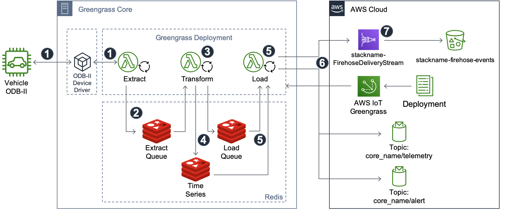

# Extract, Transform, and Load

This AWS IoT Greengrass accelerator demonstrates how to _extract_, _transform_, and _load_ (ETL) data from a local device to the cloud. This accelerator breaks the three steps into discrete processes, decoupled by persistent data queues. Each AWS Lambda process places and/or retrieves messages from these queues.

Common use cases for ETL at the edge include:

- Receiving data from different protocols such as LoRaWAN, OPC-UA, or bespoke systems and converting to standard data formats for use in Cloud workloads.
- Taking high frequency data, averaging, and then loading at a reduced rate.
- Calculating values from disparate data sources.
- Cleansing, de-duplication, or filling missing time series data elements.

> **NOTE** For brevity, AWS IoT Greengrass will be referred to as _Greengrass_ when discussing different technical aspects of the Greengrass software or use. _AWS IoT Greengrass_ will be used when referring to the actual service.

## ETL Accelerator Use Case

Imagine we want to collect from a vehicle multiple times per-second, transform and compute into a friendly formation, and when connected, store the messages in the cloud. As the vehicle travels into areas without Internet coverage, we want to ensure the local data collection continues and messages are ultimately stored in the cloud once coverage is restored.

To read the data, we use an ODB-II data logger connected to the vehicle and then query the data 10 times per second. Every message read is converted to JSON and also stored into a time series database. The content of the messages is transformed from the 8-bye OBD-II values (example: `1562433539.743263 7E8 0341055600000000`)into a readable JSON formatted message.

Finally, individual records are stored as JSON records in Amazon S3 via Amazon Kinesis Data Firehose. Also, every 30 seconds, the minimum, average, and maximum values of parameters of interest are published to AWS IoT Core via MQTT.

The design is composed of three main parts:

- The source - A vehicle with a standard [OBD-II port](https://en.wikipedia.org/wiki/On-board_diagnostics#OBD-II).
- Greengrass core - Local hardware that can connect to the vehicle via data logger, and has a connection to the AWS Cloud.
- AWS Cloud - Ultimate destination for transformed data--to Kinesis Data Firehose, AWS IoT topics, and AWS IoT Analytics.



The processing flow of the accelerator is:

1. **Extract** - This function connects to a data source and reads data in the native format. In this case, it is 8 byte CAN Bus messages. The function sends queries for OBD-II parameters of interest, which are then returned from the vehicle and captured.
1. The _Extract_ function then places these messages into the _Extract Queue_.
1. **Transform** - The _Transform_ function performs the data transformation business logic to cleanse data, perform aggregations, or otherwise process the data into usable format. In this case, it converts the ODB-II parameter messages into JSON and enriches the data with time stamps and other key-values.
1. The _transform_ messages are stored in the _Load Queue_. The values are also placed into a _Time Series_ store to be queried later for statistical values over a specific period of time.
1. **Load** - The _Load_ function reads messages from the _Load Queue_, placing the messages onto the target systems (MQTT topics and Kinesis Data Firehose in this case). Once a message has been successfully sent, the _Load_ function clears the message from the _Load Queue_. If there is no connection, the Load function will wait until connectivity is restored, and then flush the messages.
1. Messages are delivered when connectivity the Cloud is available. A Kinesis Data Firehose stream receives all messages (approximately 10 events per second for each parameter. Also, on a periodic basis, the average, minimum, and maximum values are read from the _Time Series_ store and published to the `core_name/telemetry` topic via the local Greengrass core message bus.
1. The Firehose stream then delivers the messages in an uncompressed format to the target S3 bucket. Each S3 object will contain one or individual messages expressed as JSON objects per-line in the object.

The local data stores are abstract services. For instance, the data store(s) could be a sqlite database, time series database, redis, or a Kafka set of topics. In this case, we use [FIFO queues](https://redis.io/commands/rpoplpush) for the extract and load stores, and the [Redis TimeSeries module](https://github.com/RedisTimeSeries/RedisTimeSeries) for creating statistical values.

## Design Pattern

Three Lambda functions, written in Python, perform the extract, transform, and load operations. Each is a [long-lived AWS Lambda](https://docs.aws.amazon.com/greengrass/latest/developerguide/long-testing.html) and will continue to run as long as the Greengrass service is started. Depending upon the function, basic error handling is included where exceptions may occur. For example, if the data source drivers return an error, or in the event when the Greengrass core does not have connectivity to the Internet.

Redis is used to persist data between operations. FIFO queue buffer messages between the extract and transform, as well as between the transform and load steps. A second Redis data store is used to hold time series data.

Below, each functions operations is described in more detail. All functions can be found in the `cfn/lambda_functions` directory. Each function's main execute code is the python file with the same directory name.

### Extract


The `extract.py` function is a long-lived AWS Lambda function that runs on the Greengrass core and reads data from a specific function defined in `extract_methods`. Each extract method uses a queue between the reading from the source and placing onto the Redis extract FIFO queue (data store). One thread reads data while another thread puts messages onto the queue.

### Transform


The `transform.py` function is a long-lived AWS Lambda function that reads messages from the _Extract Queue_, performs transform logic, and then places the converted message onto the _Load Queue_. Depending upon the message, values may also be placed on the Time Series data store.

In this function, business logic performs these operations:

- For each message, transform the byte values into meaningful key values from the `transformation_list` and track the last parameter and value.
- Transformed messages are placed on the _Load Queue_.
- Based on the average time value (default: 30 seconds), place a summary message of averages to the _Load Queue_.

### Load


The `load.py` function is a long-lived AWS Lambda that reads messages from the Load Queue and then loads them into the configured targets and filtered for time intervals. In this function, the targets are a Kinesis Data Firehose for all individual messages (one message per OBD-II parameter), and MQTT topics depending upon the message type. Messages types and MQTT topics are:

| MQTT Topic                       | Message(s)                                                                                                                        | Frequency                             |
| -------------------------------- | --------------------------------------------------------------------------------------------------------------------------------- | ------------------------------------- |
| Cloud<br />`core_name/telemetry` | Each rolling _average message_ with minimum, maximum, and average of specific parameters.                                         | Default: 30 seconds                   |
| Cloud<br />`core_name/alert`     | Non-OBD-II CAN Bus messages, with payload being the alert and raw CAN Bus message (timestamp, arbitration Id, hex-encoded bytes). | Per-message, maximum of 1 per second  |
| Greengrass<br />`rt`             | Each OBD-II message.                                                                                                              | Per-message, Greengrass device limits |

:exclamation: Not all of the non-ODB-II messages are published to the `core_name/alert` topic due to the amount of messages that can be seen. It is common to see greater than 500 propriety messages per-second, which is not a suitable use MQTT at a sustained rate. In the case of a large amount of non-OBD-II messages, an alert message is only sent every 1 second with the content of that message. However, all messages are sent to the Firehose delivery stream.

In normal operation, the Load function delivers the following:

- For each parameter, one message per-second to Kinesis Data Firehose.
- The aggregate telemetry message every 30 seconds to `core_name/telemetry` MQTT topic in the cloud.
- For each message, the transform JSON to `rt` via the local MQTT/AWS Lambda destination method.

## Folder Structure

```text
extract_transform_load/
├── README.md                          <-- This file!
├── cfn
│   ├── etl_accelerator-INPUT.cfn.yaml <-- CloudFormation template
│   └── lambda_functions
├── docker
│   ├── Dockerfile-greengrass
│   ├── certs
│   ├── config
│   ├── docker-compose.yml
│   ├── log
│   ├── redis
├── docs
└── test
```

There are two main components to using the accelerator. The `cfn/` directory contains the AWS CloudFormation assets to create the Greengrass configuration and long-lived AWS Lambda functions as a _Greengrass deployment_. The _deployment_ then waits for the target system, in this case a docker container, to start.

The `docker/` directory container the assets to create a Docker image and running container with the dependencies such as Redis, to run the AWS IoT Greengrass deployment. It also has directories to hold the Greengrass configuration and credentials for the Greengrass core.

## How to Deploy the Accelerator

To launch this accelerator as a Docker container, there are a few prerequisites and steps to complete. It is assumed you have basic experience with AWS IoT via the console and CLI.

The main steps for deployment are:

1. _Complete prerequisites_. Ensure there is an AWS IoT certificate and private key created and accessible locally for use.
1. _Generate and launch the CloudFormation stack_. This will create the AWS Lambda functions, the AWS IoT Greengrass resources, and an AWS IoT thing to be used as the Greengrass core. The certificate will be associated with the newly created Thing. At the end, an AWS IoT Greengrass deployment will be created and ready to be pushed to the Docker container.
1. _From CloudFormation output, create the `config.json` file_. Then place all files into the `docker/certs` and `docker/config` directories.
1. _Run the container_. Launch (`docker-compose --build up`) to build the container, which will start Greengrass in a pre-deployed state.
1. _Deploy to Greengrass core_. From the AWS Console, perform an AWS IoT Greengrass deployment that will push all resources to the container running Greengrass and start the ETL operations.

When finished, stopping the accelerator (`CTRL-C` followed by `docker-compose down`) will gracefully stop all containers and then remove then. The deployment state and any persisted data will be preserved in the `docker/` subdirectories, and used when restarted.

### Verify Prerequisites

The following is a list of prerequisites to deploy the accelerator:

- AWS Cloud
  - Ensure you have an AWS user account with permissions to manage `iot`, `greengrass`, `lambda`, `cloudwatch`, and other services during the deployment of the CloudFormation stack.
  - Create an AWS IoT Certificate and ensure it is activated and the certificate and private key files are saved locally. This certificate will be associated with an AWS IoT _thing_ created by the CloudFormation stack. Copy the certificates _Certificate ARN_, which will be used as a parameter for the CloudFormation stack. The _Certificate ARN_ will look similar to this: `arn:aws:iot:REGION:ACCOUNTNAME:cert/27b42xxxxxxx120017a`.
  - Create an S3 bucket _in the same region where CloudFormation resources will be created_ to hold the packaged files. Please see [this link](https://docs.aws.amazon.com/AWSCloudFormation/latest/UserGuide/using-cfn-cli-package.html) for more details.
- Local Environment (where running the accelerator)
  - Verify Docker Desktop or Docker Machine installed, and you have the ability to create or download images locally and run containers.
  - From the certificate creation step above, note the location of the X.509 certificate and private key registered and activated with AWS IoT.
  - Ensure a recent version of the AWS CLI is installed and a user profile with permissions mentioned above is available for use.

### Launch the CloudFormation Stack

Prior to launching the accelerator container locally, a CloudFormation package needs to be created, and then the CloudFormation stack launched from the Template. Follow the steps below to create the package via the command line, and then launch the stack via the CLI or AWS Console.

The CloudFormation template does most of the heavy lifting. Prior to running, each _input_ template needs to be processed to an _output_ template that is actually used. The package process uploads the AWS Lambda functions to the Amazon S3 bucket and creates the output template with unique references to the uploaded assets.

To create or overwrite the templates, perform the following steps from a command line or terminal session:

1. Clone the repository `git clone https://github.com/awslabs/aws-iot-greengrass-accelerators.git` and change to `aws-iot-greengrass-accelerators/accelerators/extract_transform_load/cfn`, where this README.md file is located.

1. Create the CloudFormation output file using the AWS CLI. Using the commands below, replace or set these environment variables:

   - **\$AWS_PROFILE** - Reference an AWS CLI profile in `~/.aws` with the account credentials needed to build and deploy the CloudFormation template.
   - **\$REGION** - The AWS region for deploying the stack.
   - **\$S3_BUCKET** - An existing S3 bucket to hold the CloudFormation artifacts (e.g., AWS Lambda function zip files).

   Below is a list of the commands to create the CloudFormation template file, upload assets, and create a stack (note the changes for the `--parameter-overrides` section where you need to provide the `ThingName` and `CertificateArn` values).

   ```bash
   # BASH commands (replace exports with your AWSCLI profile, region, and S3 bucket settings)
   # AWS_PROFILE contains permissions to fully create and launch the CloudFormation package and template
   export AWS_PROFILE=your-profile-here
   export REGION=us-west-2
   export S3_BUCKET=your_s3_bucket_here         # Needs to be located in same region as where
                                                # the CloudFormation stack is created.
   # Clean up any previously created files
   rm *-OUTPUT.yaml
   aws cloudformation package --template-file etl_accelerator-INPUT.cfn.yaml --output-template-file etl-accelerator-OUTPUT.yaml --s3-bucket $S3_BUCKET --profile $AWS_PROFILE --region $REGION

   # If using the AWS Console, upload the etl-accelerator-OUTPUT.yaml and continue with the parameters.
   # Below are the steps to deploy via the command line.

   # To deploy back-end stack from CLI (change --stack-name and --parameter-overrides to expected values)
   aws cloudformation deploy \
     --region $REGION \
     --stack-name greengrass-etl-accelerator \
     --template etl-accelerator-OUTPUT.yaml \
     --capabilities CAPABILITY_NAMED_IAM \
     --parameter-overrides \
       ThingName="gg_etl_accel" \
       CertificateArn="certificate ARN from prerequisites"

   # Output of stack deploy command:
   Waiting for changeset to be created..
   Waiting for stack create/update to complete
   Successfully created/updated stack - greengrass-etl-accelerator
   ```

At this point, all resources have been created and an initial AWS IoT Greengrass deployment has also been created and ready to be sent to the device.

### Configure and Launch the Docker Container

With the stack deployed, we use one output from the CloudFormation stack, the _GreengrassConfig_ value, along with the certificate and private key to complete the `config.json` so that Greengrass in the Docker container can connect and authenticate.

1. Change to the the `docker/` directory.

1. Copy over the certificate and private key files to the `certs` directory. Copy the full file names to a temporary text file for modifying the `config.json` file.

1. Download to `certs` directory the [Amazon Root CA1](https://www.amazontrust.com/repository/AmazonRootCA1.pem) root certificate authority file used to verify the AWS IoT Core and AWS IoT Greengrass endpoints. If the link opens with the contents in your browser, use alt-click and _Save As…_ instead and save as `certs/AmazonRootCA1.pem`.

1. Change to the to `docker/config` directory and create a new file named `config.json`. From the CloudFormation console, select the stack and output tab. Copy the entire contents of the _GreengrassConfig_ value, including the opening and close braces. Use your favorite JSON formatting tool to "prettify" the content. If you are using Linux or macOS with `jq` installed, the following will query and format the `config.json` content for you:

   ```bash
   $ aws --region $REGION cloudformation describe-stacks --stack greengrass-etl-accelerator | jq '.Stacks | to_entries | .[].value.Outputs | .[].OutputValue | fromjson'

   # Output
   {
     "coreThing": {
       ...
     }
   }
   ```

1. Paste into the newly created `config.json` file and replace _CERTIFICATE_NAME_HERE_ with the file name and extension of your certificate (e.g., `123beef-certificate.pem.crt`).

1. Do the same replacing _PRIVATE_KEY_FILENAME_HERE_ with the name of your private key (e.g., `123beef-private.pem.key`).

1. Save the file.

1. Change back to the `docker/` directory.

At this point, the Docker configuration has the details needed to start the containers and connect to AWS IoT Core and AWS IoT Greengrass. Using `docker-compose` in the foreground, verify that the containers start and you are receiving startup log entries:

:exclamation: The first build may take a long time to complete as it installs dependencies. Further runs will use the locally created image so startup time will be shortened.

```bash
# Make sure the latest Greengrass version is built
$ docker pull amazon/aws-iot-greengrass:1.11.3-amazonlinux-x86-64
$ docker-compose --build up
Building greengrass
Step 1/10 : FROM amazon/aws-iot-greengrass:1.11.3-amazonlinux-x86-64
...
Successfully tagged x86_64/greengrass-accelerator-etl:latest
Creating etl-greengrass ... done
Attaching to etl-greengrass
etl-greengrass | Starting Redis locally
etl-greengrass | Setting up greengrass daemon
etl-greengrass | Validating hardlink/softlink protection
etl-greengrass | Waiting for up to 1m10s for Daemon to start
etl-greengrass |
etl-greengrass | Greengrass successfully started with PID: 17
```

8. From the AWS IoT Greengrass Console, navigate to your Greengrass Group and perform _Actions->Deploy_ to deploy to the running Docker container.

To verify operation, you can review the content of the AWS Lambda log files located in `docker/log/user/…/`, to verify the extract and transform functions are processing data. Also, the Amazon S3 bucket used by Amazon Kinesis Data Firehose should start to receive events. You can obtain the bucket name from the CloudFormation stack _Outputs_ section in the AWS Console. Every 30 seconds, statistical messages will also be published on the MQTT topic `core_name/telemetry` (default being `gg_etl_accel/telemetry`).

> **NOTE** The OBD-II replay file will run for approximately 37 minutes. Restarting the Greengrass core will reset the extract function and start the replay process again.

### Visualizing the Data

By downloading one of the Amazon Kinesis Data Firehose created files from the S3 bucket deployed as part of the stack (name starts with _greengrass-atl-accelerate-firehouse-event_), you can view the contents and see that this is all the messages, each as a single JSON message per-line.

Using Amazon Athena, modify the following SQL and run the query to create a database and table from your Firehose events S3 bucket (copy the actual S3 bucket name and replace the _LOCATION_ entry below):

```sql
CREATE EXTERNAL TABLE IF NOT EXISTS default.gg_etl (
  `pid` string,
  `value` float,
  `units` string,
  `source` string,
  `timestamp` timestamp
)
ROW FORMAT SERDE 'org.openx.data.jsonserde.JsonSerDe'
WITH SERDEPROPERTIES (
  'serialization.format' = '1'
) LOCATION 's3://greengrass-etl-accelerator-firehose-events-NNNNNNNN/firehose/'
TBLPROPERTIES ('has_encrypted_data'='false');
```

Once create, you can then directly query the data from Amazon Athena, or use the database and table as a data source for Amazon QuickSight. Here is an Amazon Athena query of vehicle speed, limited to first 10 records:

```sql
SELECT * FROM default.gg_etl WHERE pid = 'VehicleSpeed'
LIMIT 10
```

It will return something similar to this:


You may need to run the query more than once if the values returned are all zeros.

## Accelerator Cleanup

To stop any potential costs from accruing, follow these steps to stop and delete all AWS resources:

1. From the terminal window where docker-compose is running, issue a CTRL+C command stop the container.
1. Run the command `docker-compose down` to release all resources.
1. Delete all of the contents of the Firehose events bucket.
1. From the Cloudformation console, delete the `greengrass-etl-accelerator` stack.
1. Optional: In you do not intend to use the device certificate again, from the IoT console->Secure-Certificates, delete the certificate.
1. From CloudWatch->Logs->Log groups, select and delete any logs created by CloudFormation or the Greengrass core itself.
1. In the `docker/` directory, delete the contents of the `certs/`, `config/`, `deployment/`, `log/`, and `redis/` directories. Or simply delete the entire repository if you are done using the accelerator.

## Modifications

The most common modifications would be to replace the code for three AWS Lambda functions with code specific for your use case. To modify, start with the _Extract_ function, view the contents of the _Extract Queue_, and then continue in a similar manner with the _Transform_ and _Load_ functions based on the _Load Queue_.

## FAQ and Help

### The `docker-compose` command shows `etl-greengrass exited with code 143`

#### Resolution

1. Check that the certificate and private key files are in the correct location, and they are referenced by the correct names in the `config.json` file.
1. Ensure there is at least one AWS Lambda function defined within the AWs IoT Greengrass group and that all container-based settings such as Isolation mode are set properly.

### Cloudformation does not delete the stack with error "The following resource(s) failed to delete: [FirehoseBucket]."

#### Resolution

1. Ensure all objects have been deleted from the `greengrass-etl-accelerator-firehose-events-NNNNNNNN` bucket, where `NNNNNNN` will be a random number.
1. Perform the CloudFormation delete stack operation again.
