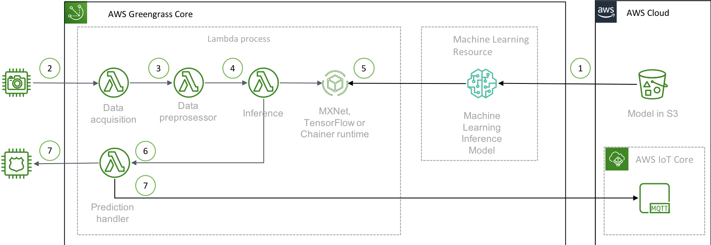

# Greengrass Machine Learning Inference (MLI) with pre-trained model uploaded to S3

This document describe the steps in setting up Greengrass Machine Learning Inference, using a pre-trained model uploaded to S3.

## Design Pattern



The common design patterns of using a pre-trained model in S3 bucket:

1. When the Greengrass configuration is being deployed, the Greengrass Core will download the model from the S3 bucket as configured in the Machine Learning Resources, to the local disk, and extract the files from the compressed `.tar.gz` or `.zip`.
2. **Data acquisition** - This function periodically acquire the raw data inputs from a image source. In this example, we are using static images to simulate image sources.
3. **Data preprocessor** - This function pre-process the image by resize to the images used to train the model.
4. **Estimator** - This function predict the data input with data loaded in MXNet runtime
5. The MXNet runtime loads the model from the local path 
6. The process will handle the prediction result, with object detected and confidence level.
7. The result can be used to trigger an action, or send it back to the cloud for further processing.

## How to Deploy the Accelerator

To launch this accelerator, there are a few prerequisites and steps to complete. It is assumed you have basic experience with AWS IoT via the console and CLI.

The main steps for deployment are:
1. _Complete prerequisites._ Ensure there is an AWS IoT certificate and private key created and accessible locally for use.
2. _Generate and launch the CloudFormation stack._ This will create the Lambda functions, the Greengrass resources, and an AWS IoT thing to be used as the Greengrass Core. The certificate will be associated with the newly created Thing. At the end, a Greengrass deployment will be created and ready to be pushed to the Greengrass core hardware.
3. _Create the config.json file_, using the outputs from the CloudFormation. Then place all files into the `/greengrass/certs` and `/greengrass/config` directories.
5. _Deploy to Greengrass_. From the AWS Console, perform a Greengrass deployment that will push
all resources to the Greengrass Core and start the MLI operations.

### Verify Prerequisites

The following is a list of prerequisites to deploy the accelerator:

* AWS Cloud
  * Ensure you have an AWS user account with permissions to manage `iot`, `greengrass`, `lambda`, `cloudwatch`, and other services during the deployment of the CloudFormation stack.
  * Create an AWS IoT Certificate and ensure it is activated and the certificate and private key files are saved locally. This certificate will be associated with an AWS IoT *thing* created by the CloudFormation stack. Copy the certificates *Certificate ARN*, which will be used as a parameter for the CloudFormation stack. The *Certificate ARN* will look similar to this: `arn:aws:iot:REGION:ACCOUNTNAME:cert/27b42xxxxxxx120017a`, and the *Certificate ID* is the trailing alphanumerics, such as `27b42xxxxxxx120017a`
    * You can use this AWS CLI command to create new certificate. The output value from the CLI, *Certificate ID* will be needed to create the CloudFormation stack. 
     ```bash
     aws iot create-keys-and-certificate --certificate-pem-outfile "mli.cert.pem" --public-key-outfile "mli.public.key" --private-key-outfile "mli.private.key" --set-as-active --query certificateId --output text
     ``` 
  * *In the same region where CloudFormation resources will be created*, create S3 bucket to hold the packaged files. Please see [this link](https://docs.aws.amazon.com/AWSCloudFormation/latest/UserGuide/using-cfn-cli-package.html) for more details. This bucket needs to have read and write access by the IAM role that is running the CloudFormation `package` and `deploy`.
  * *In the same region where Greengrass Core will be connecting to*, create S3 bucket to hold the pre-trained model. If you are using the managed policy `arn:aws:iam::aws:policy/service-role/AWSGreengrassResourceAccessRolePolicy`, you need to have either **`Greengrass`** or **`SageMaker`** in your bucket name in order for the Greengrass core to access the S3 bucket, for example, `${AWS Account ID}-us-east-1-greengrass-ml`

* Local Environment (where running the accelerator)
  * From the certificate creation step above, note the location of the X.509 certificate and private key registered and activated with AWS IoT.
  * Ensure a recent version of the AWS CLI is installed and a user profile with permissions mentioned above is available for use.

* Greengrass Core
     * **AWS IoT Greengrass Machine Learning Runtimes and Precompiled Libraries** - details in https://docs.aws.amazon.com/greengrass/latest/developerguide/what-is-gg.html#gg-ml-runtimes-pc-libs
     * **AWS IoT Greengrass Core SDK Software** which can be installed using pip command `sudo pip3.7 install greengrasssdk`
     * **OpenCV** for Python3.7
  * Steps on running Greengrass on EC2 can be found in [AWS Greengrass Core on AWS EC2](#AWS-Greengrass-Core-on-AWS-EC2)

### Pre-trained model

There are pre-trained models available from model zoo. Inception-BN is one of them, which can be downloaded from mxnet.io.

1. Download the `symbol.json`, `synset.txt` and the `params` from mxnet.io

```bash
wget http://data.mxnet.io/models/imagenet/inception-bn/Inception-BN-symbol.json \
&& wget http://data.mxnet.io/mxnet/models/imagenet/synset.txt \
&& wget -O Inception-BN-0000.params http://data.mxnet.io/models/imagenet/inception-bn/Inception-BN-0126.params
```

1. Create a zip file that contains the 3 artifacts
```bash
zip inception-bn.zip Inception-BN-symbol.json synset.txt Inception-BN-0126.params
```

1. Upload the model to the S3 bucket created to hold the pre-trained model, such as the example bucket `${AWS Account ID}-us-east-1-greengrass-ml`.

### Launch the CloudFormation Stack

Prior to launching the accelerator locally, a CloudFormation package needs to be created, and then the CloudFormation stack launched from the Template. Follow the steps below to create the package via the command line, and then launch the stack via the CLI or AWS Console.

The CloudFormation template does most of the heavy lifting. Prior to running, each *input* template needs to be processed to an *output* template that is actually used. The package process uploads the Lambda functions to the S3 bucket and creates the output template with unique references to the uploaded assets. 

To create or overwrite the templates, perform the following steps from a command line or terminal session:

1. Clone the repository `git clone https://github.com/awslabs/aws-iot-greengrass-accelerators.git` and change to `aws-iot-greengrass-accelerators/accelerators/machine_learning_inference`, where this `s3_models.MD` file is located.

1. Create the CloudFormation output file using the AWS CLI.  Using the commands below, you can either preset the \$AWS_PROFILE, \$REGION, \$CFN_S3_BUCKET, \$ML_S3_BUCKET_URI, \$THINGNAME and \$CERTIFICATE_ID variables, or reference those directly via the `aws cloudformation package` command. The result of that command will be an *OUTPUT* CloudFormation template file, along with the packaged Lambda functions being copied to the S3 bucket. The `AWS_PROFILE` contains the credentials, account details, and optionally region to create the CloudFormation stack.

   Complete list of commands to create the CloudFormation template file, upload assets, and create a stack (note the changes for the `--parameter-overrides` section).
   
   ```bash
   # BASH commands (replace exports with your AWSCLI profile, region, and S3 bucket settings)
   # AWS_PROFILE contains permissions to fully create and launch the CloudFormation package and template
   export AWS_PROFILE=<your-profile-here>
   export AWS_REGION=<your-region>
   export CFN_S3_BUCKET=<your_s3_bucket_that_holds_cloudformation>         # Needs to be located in same region as where the CloudFormation stack is created.
   export ML_S3_BUCKET_URI=<s3 uri of the model, such as s3://[s3 bucket]/[model in .tar.gz or .zip]> 
   export CORENAME=<Thing name of the device to be the GreenGrass Core>
   export CERTIFICATE_ID=<Certificate ID>
                                                
   # Clean up any previously created files
   rm *-OUTPUT.yaml
   aws cloudformation package \
   --template-file cfn/mli_accelerator_s3_models-INPUT.cfn.yaml \
   --output-template-file mli_accelerator_s3_models-OUTPUT.yaml \
   --s3-bucket ${CFN_S3_BUCKET} --profile ${AWS_PROFILE} --region ${AWS_REGION}
     
   # If using the AWS Console, upload the mli_accelerator_s3_models-OUTPUT.yaml and continue with the parameters.
   # Below are the steps to deploy via the command line.
     
   # To deploy back-end stack from CLI (change --stack-name and --parameter-overrides to expected values)
   aws cloudformation deploy \
     --profile ${AWS_PROFILE} \
     --region ${AWS_REGION} \
     --stack-name greengrass-mli-accelerator \
     --template mli_accelerator_s3_models-OUTPUT.yaml \
     --capabilities CAPABILITY_NAMED_IAM \
     --parameter-overrides \
       CoreName=${CORENAME} \
       CertIdParam=${CERTIFICATE_ID} \
       ModelS3Uri=${ML_S3_BUCKET_URI}
   ```

At this point, all resources have been created and an initial Greengrass deployment has also been created and ready to be sent to the device.

### Configure and Starts the Greengrass Core

With the stack deployed, we use one output from the CloudFormation stack, the *GreengrassConfig* value, along with the certificate and private key to complete the `config.json` so that Greengrass Core can connect and authenticate.

1. In the local computer, create a temporary folder, such as `greengrass/`.
1. Make 2 folders in the temporary folder, `certs/` and `config/`.
1. Change into `certs` folder
   1. Download to `certs` directory the [Amazon Root CA1](https://www.amazontrust.com/repository/AmazonRootCA1.pem) root certificate authority file used to verify the AWS IoT and AWS Greengrass endpoints. If the link opens with the contents in your browser, use alt-click and *Save As…* instead and save as `certs/AmazonRootCA1.pem`.
   1. Copy the certificate and private key files into the `certs/` folder
1. Change into `config/` folder 
   1. Retrieve the `config.json` created from the CloudFormation, using the AWS CLI command
   ```bash
   aws cloudformation describe-stacks \
   --stack-name greengrass-mli-accelerator \
   --output text \  
   --query 'Stacks[*].Outputs[?OutputKey==`GreengrassConfig`].OutputValue' 
   ```
   or you can pipe through a Python json tool for pretty print:
   ```bash
   aws cloudformation describe-stacks \
   --stack-name greengrass-mli-accelerator \
   --output text \  
   --query 'Stacks[*].Outputs[?OutputKey==`GreengrassConfig`].OutputValue' 
   | python -m json.tool 
   ```
   1. Paste the output to file `config.json` in the `config/` folder
   1. Open `config.json` file and replace *CERTIFICATE_NAME_HERE* with the file name and extension of your certificate (e.g., `123beef-certificate.pem.crt`).
   1. Do the same replacing *PRIVATE_KEY_FILENAME_HERE* with the name of your private key (e.g., `123beef-private.pem.key`).
   1. Save the file.
1. Change into the temporary folder, the parent folder of both `certs/` and `config/`
1. Compress both `certs/` and `config/` into a single file, such as `zip -r greengrass-setup.zip certs/* config/*`
1. Copy the `greengrass-setup.zip` to the Greengrass Core machine, such as using command `scp`
1. Remote access to the Greengrass Core machine, such as using command `ssh`
1. Go to the folder where Greengrass was installed, such as `/greengrass`
1. Unzip the contents from the 2 folders in `greengrass-setup.zip` into `certs/` and `config/` folders respectively, using the command `sudo unzip -o greengrass-setup.zip -d /greengrass`
1. Verify that all certificates are in the `certs/` folder, and `config.json` is in the `config/` folder.
1. Restart the Greengrass software, such as using the command `sudo /greengrass/ggc/core/greengrassd restart`, or `sudo systemctl restart greengrass` if Greengrass Core is under `systemctl` management.
1. Monitor the log file of the Greengrass software to make sure that Greengrass software started properly, such as using the command `tail -F /greengrass/ggc/var/log/system/runtime.log`.
1. If the Greengrass software started properly, you should see these in the log file
   ```log
   [2019-08-18T01:14:55.69-07:00][INFO]-===========================================
   [2019-08-18T01:14:55.69-07:00][INFO]-Greengrass Version: 1.9.2-RC4
   [2019-08-18T01:14:55.69-07:00][INFO]-Greengrass Root: /greengrass
   [2019-08-18T01:14:55.69-07:00][INFO]-Greengrass Write Directory: /greengrass/ggc
   [2019-08-18T01:14:55.69-07:00][INFO]-Group File Directory: /greengrass/ggc/deployment/group
   [...]
   [2019-08-18T01:14:56.739-07:00][INFO]-All topics subscribed.    {"clientId": "<THING NAME>"}
   ```
1. From the Greengrass Console, navigate to your created Greengrass Group and perform *Actions->Deploy* to deploy to the Greengrass Core machine.
   1. Alternatively, Greengrass deployment command can be found in from the CloudFormation stack, using the command below:

   ```bash
   aws cloudformation describe-stacks \
   --stack-name greengrass-mli-accelerator \
   --output text \
   --query 'Stacks[*].Outputs[?OutputKey==`CommandToDeployGroup`].OutputValue' 
   ```
   The output will be the command that you can copy and run to deploy to the Greengrass core, for example, 

   ```bash
   aws --region <AWS Region> greengrass create-deployment --group-id <Greengrass Group ID> --deployment-type NewDeployment --group-version-id $(cut -d'/' -f6 <<< arn:aws:greengrass:<AWS Region>:<AWS Account ID>:/greengrass/groups/<Greengrass Group ID>/versions/<Greengrass Group Version ID> )
   ```

### AWS Greengrass Core on AWS EC2

To test out this accelererator without any hardware, you can install the Greengrass on an EC2 to simulate as a Greengrass Core

1. Create a EC2 running Greengrass, using the Cloudformation template in `cfn/greengrass_core_on_ec2-s3_models.cfn.yml`, or with one of the following:

|AWS Region|Region|CloudFormation|
|-|-|-|
|US East (Ohio)|us-east-2|[](https://console.aws.amazon.com/cloudformation/home?region=us-east-2#/stacks/new?stackName=aws-iot-greengrass-mli&templateURL=https://s3.amazonaws.com/cloudformation-stacks-us-east-1/aws-iot-greengrass-accelerators/machine_learning_inference/greengrass_core_on_ec2-s3_models.cfn.yml)|
|US East (N. Virginia)|us-east-1|[](https://console.aws.amazon.com/cloudformation/home?region=us-east-1#/stacks/new?stackName=aws-iot-greengrass-mli&templateURL=https://s3.amazonaws.com/cloudformation-stacks-us-east-1/aws-iot-greengrass-accelerators/machine_learning_inference/greengrass_core_on_ec2-s3_models.cfn.yml)|
|US West (Oregon)|us-west-2|[](https://console.aws.amazon.com/cloudformation/home?region=us-west-2#/stacks/new?stackName=aws-iot-greengrass-mli&templateURL=https://s3.amazonaws.com/cloudformation-stacks-us-east-1/aws-iot-greengrass-accelerators/machine_learning_inference/greengrass_core_on_ec2-s3_models.cfn.yml)|
|Asia Pacific (Mumbai)|ap-south-1|[](https://console.aws.amazon.com/cloudformation/home?region=ap-south-1#/stacks/new?stackName=aws-iot-greengrass-mli&templateURL=https://s3.amazonaws.com/cloudformation-stacks-us-east-1/aws-iot-greengrass-accelerators/machine_learning_inference/greengrass_core_on_ec2-s3_models.cfn.yml)|
|Asia Pacific (Seoul)|ap-northeast-2|[](https://console.aws.amazon.com/cloudformation/home?region=ap-northeast-2#/stacks/new?stackName=aws-iot-greengrass-mli&templateURL=https://s3.amazonaws.com/cloudformation-stacks-us-east-1/aws-iot-greengrass-accelerators/machine_learning_inference/greengrass_core_on_ec2-s3_models.cfn.yml)|
|Asia Pacific (Singapore)|ap-southeast-1|[](https://console.aws.amazon.com/cloudformation/home?region=ap-southeast-1#/stacks/new?stackName=aws-iot-greengrass-mli&templateURL=https://s3.amazonaws.com/cloudformation-stacks-us-east-1/aws-iot-greengrass-accelerators/machine_learning_inference/greengrass_core_on_ec2-s3_models.cfn.yml)|
|Asia Pacific (Sydney)|ap-southeast-2|[](https://console.aws.amazon.com/cloudformation/home?region=ap-southeast-2#/stacks/new?stackName=aws-iot-greengrass-mli&templateURL=https://s3.amazonaws.com/cloudformation-stacks-us-east-1/aws-iot-greengrass-accelerators/machine_learning_inference/greengrass_core_on_ec2-s3_models.cfn.yml)|
|Asia Pacific (Tokyo)|ap-northeast-1|[](https://console.aws.amazon.com/cloudformation/home?region=ap-northeast-1#/stacks/new?stackName=aws-iot-greengrass-mli&templateURL=https://s3.amazonaws.com/cloudformation-stacks-us-east-1/aws-iot-greengrass-accelerators/machine_learning_inference/greengrass_core_on_ec2-s3_models.cfn.yml)|
|China (Beijing)|cn-north-1|[](https://console.aws.amazon.com/cloudformation/home?region=cn-north-1#/stacks/new?stackName=aws-iot-greengrass-mli&templateURL=https://s3.amazonaws.com/cloudformation-stacks-us-east-1/aws-iot-greengrass-accelerators/machine_learning_inference/greengrass_core_on_ec2-s3_models.cfn.yml)|
|EU (Frankfurt)|eu-central-1|[](https://console.aws.amazon.com/cloudformation/home?region=eu-central-1#/stacks/new?stackName=aws-iot-greengrass-mli&templateURL=https://s3.amazonaws.com/cloudformation-stacks-us-east-1/aws-iot-greengrass-accelerators/machine_learning_inference/greengrass_core_on_ec2-s3_models.cfn.yml)|
|EU (Ireland)|eu-west-1|[](https://console.aws.amazon.com/cloudformation/home?region=eu-west-1#/stacks/new?stackName=aws-iot-greengrass-mli&templateURL=https://s3.amazonaws.com/cloudformation-stacks-us-east-1/aws-iot-greengrass-accelerators/machine_learning_inference/greengrass_core_on_ec2-s3_models.cfn.yml)|
|EU (London)|eu-west-2|[](https://console.aws.amazon.com/cloudformation/home?region=eu-west-2#/stacks/new?stackName=aws-iot-greengrass-mli&templateURL=https://s3.amazonaws.com/cloudformation-stacks-us-east-1/aws-iot-greengrass-accelerators/machine_learning_inference/greengrass_core_on_ec2-s3_models.cfn.yml)|


1. Once the instance is created, copy the `greengrass-setup.zip` to the EC2
1. In the EC2, extract `greengrass-setup.zip` into `/greengrass` folder using command `sudo unzip -o greengrass-setup.zip -d /greengrass`
1. Restart the Greengrass daemon using the command `sudo systemctl restart greengrass`

### Expected Output

The predictions will be published from the Greengrass Core to the cloud, via topic `mli/predictions/<THING NAME>`. The message can be observed using the MQTT Test client in AWS IoT Console

1. Login to https://console.aws.amazon.com/iot/home?#/test
1. Change to the region where the Greengrass Core is connecting to
1. In the `Subscription topic`, enter either the specific topic for the Greengrass Core `mli/predictions/<THING NAME>` or generic topic `mli/predictions/#`
1. Select `Subscribe`
1. The prediction messages should be shown in the console, such as 
```
[
  {
    "confidence": "0.21719395",
    "prediction": "n03983396 pop bottle, soda bottle"
  }
]
```

## FAQ and Help

Good reference of common issues can be found in https://github.com/awsdocs/aws-greengrass-developer-guide/blob/master/doc_source/gg-troubleshooting.md

### Model S3 bucket in different region

If you see the following error in the Greengrass Core log `/greengrass/ggc/var/log/system/runtime.log`, one of the reason could be that the S3 bucket holding the machine learning model is in the different region where the Greengrass Core is connecting to. 

```bash
[2019-08-15T20:51:21.259-07:00][ERROR]-Greengrass deployment error: unable to download the artifact.	{"artifactId": "5a7a5480-661d-4f8a-9e5b-bbcf81943fcc", "errorString": "error while downloading: error while downloading the ML Model with arn: be266506b5356d86781618dfe5922502bc60d38d1931e6feaccc7e68ca4ac02b.zip::1565927368000: Error status code received while downloading file: /tmp/greengrass/artifacts/be266506b5356d86781618dfe5922502bc60d38d1931e6feaccc7e68ca4ac02b.zip::1565927368000/mlmodel, status code: 400"}
```

#### Resolution
Check the region of the Greengrass Core endpoint in the `/greengrass/config/config.json` and ensure that the S3 bucket holding the model is in the same region.

### ML model resource download issue

If you encountered the follow error in `var/logs/system/runtime.log`, it is due to the isolation mode of the Lambda function that is associated with the ML resource. 

```
We cannot deploy because the group definition is invalid or corrupted for the following reasons: {ErrorSet(errorSet=[ErrorModel(errorCode=RESOURCE_TYPE_UNEXPECTED_ERROR, errorMsg=Function arn:aws:lambda:<AWS Region>:<AWS Account ID>:function:pinned-s3-mli2:GreenGrassAlias refers to resource of type 'ML_Model.S3_Object' that is not allowed in IsolationMode='NoContainer')])}
```

#### Resolution
Either change the isolation mode of the lambda to `GreengrassContainer`, or check if the resources have accidentally associated to the wrong Lambda function

### Missing MXNet libraries in the Greengrass Core

If you see the follow errors in `/greengrass/ggc/var/log/user/<AWS REGION>/<AWS ACCOUNT>/pinned-ggc-mli-stack.log`, you might be missing the mxnet libraries 

```
[2019-08-28T16:21:01.581Z][FATAL]-lambda_runtime.py:347,Failed to initialize Lambda runtime due to exception: No module named mxnet
```

#### Resolution

Remote access to the Greengrass Core, and install the libraries following the steps in https://docs.aws.amazon.com/greengrass/latest/developerguide/what-is-gg.html#gg-ml-runtimes-pc-libs

1. Download the correct library according to your hardware type to the Greengrass Core hardware
2. Extract and run the installer

### Out-of-memory

```
[2019-08-28T21:29:03.757Z][WARN]-Worker consumed all allocated memory! Memory Usage (KB).	{"workerId": "e544111a-03f5-40da-5e5c-23df2f6ced65", "funcArn": "arn:aws:lambda:<AWS Region>:<AWS Account ID>:function:pinned-ggc-mli-stack:6", "memSize": 120000, "memUsed": 165172}
[2019-08-28T21:29:03.757Z][ERROR]-Worker is ungracefully killed.	{"workerId": "e544111a-03f5-40da-5e5c-23df2f6ced65", "funcArn": "arn:aws:lambda:<AWS Region>:<AWS Account ID>:function:pinned-ggc-mli-stack:6", "state": "signal: killed"}
```
