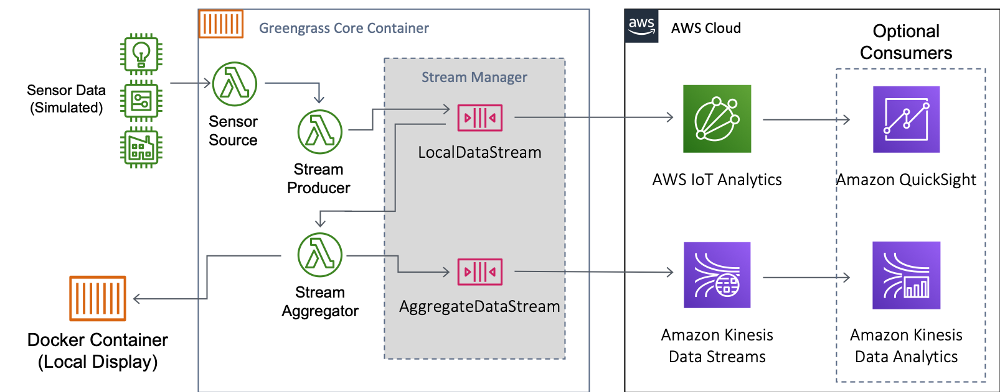
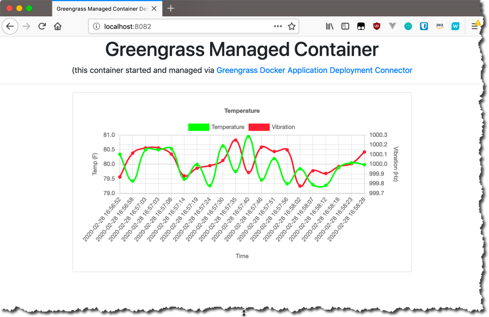

# AWS IoT Greengrass Stream Manager

This Greengrass accelerator demonstrates the use of the [AWS IoT Greengrass stream manager](https://docs.aws.amazon.com/greengrass/latest/developerguide/stream-manager.html) (stream manager) and the [Greengrass Docker Application Deployment Connector](https://docs.aws.amazon.com/greengrass/latest/developerguide/docker-app-connector.html) features as depicted in [this blog post](https://aws.amazon.com/blogs/aws/new-aws-iot-greengrass-adds-docker-support-and-streams-management-at-the-edge/).

Common use cases for stream manager include:

- Local video processing
- Image recognition
- High-volume data collection
- Handles disconnected or intermittent connectivity scenarios
- Prioritization of data path to the cloud for multiple streams

# Stream Manager Use Case



In this use case, we create two **local data streams**, with the first stream, _LocalDataStream_, configured for low-priority export to AWS IoT Analytics and a set amount of local disk space and overwriting the old data. The second stream, _AggregateDataStream_, exports data with high priority to an Amazon Kinesis Data Stream, again using local resources for data persistence.

There are three deployed Lambda functions and a Greengrass managed Docker container that serve different purposes:

- **Sensor Source Function** - Generates simulated data for use by the rest of the accelerator.
- **Stream Producer Function** - Reads sensor data at high volume (20 readings per-second) and writes it to the _LocalDataStream_.
- **Stream Aggregator Function** - Reads the _LocalDataStream_, aggregates the data by creating an average per sensor every five seconds, then writes the aggregate message to the _AggregateDataStream_.
- **Greengrass Managed Docker Container** - A Flask web application running in a Docker container that reads the aggregate values from the _Stream Aggregator Function_, displaying the aggregated information.

The two streams are used locally and also export the data to AWS IoT Analytics for the raw data, and to Amazon Kinesis Data Streams for the aggregated data.

# Design Pattern

To demonstrate both Stream Manager and the Greengrass Docker application deployment connector, a Lambda function is created to generate test sensor data, which is then read by the _Producer Function_ and processed as described above. The data is sent AWS IoT Analytics and an Amazon Kinesis Data Stream in the cloud.

The Stream Manager creates and persists the data locally, and sends to the cloud when there is connectivity. The Greengrass managed container, a web Flask application, displays the aggregate data from the Stream Aggregator function.

Greengrass can execute as either daemon on a host (Docker optional) or as a Docker container. All functionality is available in both methods, with the exception that when running as a container, all Docker-related actions are managed by the `dockerd` daemon at the host level.


This accelerator has been designed to run within a Docker container and utilizing the hosts Docker daemon to run Greengrass _and_ the contents of the `docker-compose` file sent to Greengrass. In this manner, the accelerator can run on any host with Docker support installed. The main difference in running both Greengrass and the managed containers is that they container(s) are running side-by-side on the host system.

The accelerator can also be modified to run on an existing Greengrass 1.10.0 or newer host installation by not running the `docker-compose up -d` steps below, but by using the contents of the `gg_docker/config/config.json` and `gg_docker/certs/` with you own host system.

The Cloud Development Kit (CDK) is used to deploy a CloudFront stack, and a Python script creates the local assets required, such as the certificate and key pair used by the Greengrass core. The second component is a Docker compose file that runs Greengrass locally.

# Folder Structure

```text
stream_manager/
├── README.md                          <-- This file!
├── cdk
│   ├── etl_accelerator-INPUT.cfn.yaml <-- CloudFormation template
│   ├── lambda_functions
│   └── other_files
├── docker_compose_stack               <-- Compose stack to be managed by Greengrass
│   ├── docker-compose.yml             <-- Compose file to be run
├── gg_docker                          <-- Creates Greengrass instance as container
│   ├── Dockerfile-greengrass
│   ├── certs
│   ├── config
│   ├── deployment
│   ├── docker-compose.yml
│   └── log
├── docs
└── test
```

There are two main components to using the accelerator. The `cdk/` directory contains the CDK assets to create the Greengrass configuration and long-lived Lambda functions as a _Greengrass deployment_.

The `gg_docker/` directory container the assets to create a Docker image and run Greengrass as a container locally. It also has directories to hold the Greengrass configuration and credentials for the Greengrass Core, along with the log files.

# How to Deploy the Accelerator

To launch this accelerator as a Docker container, there are a few prerequisites and steps to complete. It is assumed you have basic experience with AWS IoT via the console and CLI.

## Prerequisites

The following is a list of prerequisites to deploy the accelerator:

- Ensure you have an AWS user account with permissions to create and manage `iot`, `greengrass`, `lambda`, `cloudwatch`, and other services used by CloudFormation (CDK).
- Install the AWS CLI locally and create a [named profile](https://docs.aws.amazon.com/cli/latest/userguide/cli-configure-profiles.html) with credentials for the AWS user account. For Cloud9, there is a profile already created named _default_.
- Install the [AWS Cloud Development Kit](https://docs.aws.amazon.com/cdk/latest/guide/getting_started.html) and perform a [bootstrap](https://docs.aws.amazon.com/cdk/latest/guide/troubleshooting.html#troubleshooting_nobucket) in the region you will be working.
- Verify Docker Desktop or Docker Machine installed, and you have the ability to create or download images locally and run containers.

There are two methods describe below:

- If you are familiar with Nodejs, Python and working with the command line on your local system, select the _Create and Launch the Accelerator Locally_ method.
- For all others, use the _Step-by-Step: Create and Launch the Accelerator via AWS Cloud9_ method.

## Create and Launch the Accelerator Locally

<details>
<summary>Click here to show/hide the steps to run locally</summary>
<br>
:bulb:These steps assume familiarity with installation of NPM packages, Python, and working at the command line. For a getting-started deployment process, see the next section for a step-by-step deploying via AWS Cloud9.

1. Install and bootstrap the CDK:

   ```bash
   npm install -g aws-cdk
   export ACCOUNT=$(aws sts get-caller-identity --query Account --output text)
   # Set REGION to where the accelerator will be installed
   export REGION=us-east-1
   cdk bootstrap aws://$ACCOUNT/$REGION
   ```

1. Clone the repository and change into the `cdk/` directory, build and deploy the CloudFormation stack:

   ```bash
   git clone https://github.com/awslabs/aws-iot-greengrass-accelerators.git
   cd aws-iot-greengrass-accelerators/accelerators/stream_manager/cdk
   npm install
   npm run build
   # Set region for deployment (optional if the AWS CLI profile has the region set to where you want to deploy)
   export CDK_DEPLOY_REGION=us-east-1
   # replace PROFILE_NAME with your specific AWS CLI profile that has username and region
   cdk --profile PROFILE_NAME deploy
   ```

1. At this point the CloudFormation stack is deployed. Next, run the `deploy_resources.py` script, which will:

   1. Read the local CDK output to determine the CloudFormation stack name
   1. From the CloudFormation stack output, read the values to:
      1. Create the `config.json` file for Greengrass in the `stream_manager/gg_docker/config` directory
      1. Create the `certificate.pem` and `private_key.pem` files in the `stream_manager/gg_docker/certs` directory
   1. And finally upload the `stream_manager/docker_compose_stack/docker-compose.yml` file to the S3 directory referenced by the Greengrass Docker Application Deployment Connector.

   ```bash
   python3 deploy_resources.py -p default
   ```

1. Next, change to the `stream_manager/gg_docker` directory and start Greengrass running as Docker container. If you intend to run Greengrass on a physical device, copy the contents of the `stream_manager/gg_docker/certs` and the `stream_manager/gg_docker/config` directories to your core (e.g., `/greengrass/certs` and `/greengrass/config`).

   ```bash
   cd ../gg_docker
   # Build from the latest published version of Greengrass
   docker pull amazon/aws-iot-greengrass:1.11.3-amazonlinux-x86-64
   docker-compose build
   docker-compose up -d
   ```

At this point, the CloudFormation stack has been deployed and the Greengrass container is running. The CloudFormation stack will also trigger an initial deployment of all resources to the Greengrass Core, so the Lambda functions, Stream Manager, and docker containers are also running.

Greengrass will start to write files into the `gg_docker/log` directory, and the web interface to the Flask application can be locally accessed via http://localhost:8082 (IP address dependent on your local Docker process).

</details>

## Step-by-Step: Create and Launch the Accelerator via AWS Cloud9

<details>
<summary>Click here to show/hide the steps to run via AWS Cloud9</summary>
<br>
:bulb: All steps below use a Cloud9 IDE in the same account and region where the accelerator will be run. If running locally, ensure you have the AWS CLI installed, and change the AWS named profile from *default* to one you have created with proper permissions.

Prior to launching the accelerator container locally, the AWS CDK is used to generate a CloudFormation template and deploy it. From Cloud9, follow the steps to create and launch the stack via the CDK.

1.  Create a new Cloud9 IDE and make sure that **Amazon Linux 2** and **t3.small** are selected.

    :exclamation:The following steps **will not** work if Ubuntu is selected.

1.  Once the Cloud9 environment starts, follow [these steps](https://docs.aws.amazon.com/cloud9/latest/user-guide/move-environment.html#move-environment-resize) to resize the disk. Create the `resize.sh` file and run `sh resize.sh 40` to extend the disk to 40GiB.

1.  _Pre-requisites_ (only needs be run once and the environment will reboot) - Open a new Terminal window and run these commands:

    ```bash
    # Cloud9 Commands - change as needed for local development environment
    # Install pre-requisites, bootstrap CDK for use in account/region, and reboot
    npm uninstall -g cdk
    npm install -g aws-cdk@1.69.0
    sudo yum install iptables-services -y
    # Bootstrap CDK for current AWS account and region where Cloud9 runs
    ACCOUNT=$(aws sts get-caller-identity --query Account --output text)
    REGION=$(aws configure get region)
    cdk bootstrap aws://$ACCOUNT/$REGION
    sudo curl -L "https://github.com/docker/compose/releases/download/1.25.3/docker-compose-$(uname -s)-$(uname -m)" -o /usr/local/bin/docker-compose
    sudo chmod +x /usr/local/bin/docker-compose
    pip3 install boto3
    # Enable soft/hard links
    sudo cat <<EOF | sudo tee /etc/sysctl.d/98-cloud9-greengrass.conf
    fs.protected_hardlinks = 1
    fs.protected_symlinks = 1
    EOF
    # Allow access to Cloud9 instance for local Flask app
    # Add inbound for port 80 to the flask app (80->8082)
    sudo systemctl enable iptables
    sudo /sbin/iptables -A PREROUTING -t nat -i eth0 -p tcp --dport 80 -j REDIRECT --to-port 8082
    sudo service iptables save
    aws ec2 authorize-security-group-ingress --group-name $(curl -s http://169.254.169.254/latest/meta-data/security-groups) --protocol tcp --port 80 --cidr 0.0.0.0/0
    sudo reboot
    ```

1.  Build and deploy. Once Cloud9 has restarted, issue these commands. If the terminal window is unresponsive, open a new one.

    ```bash
    # After reboot open a new terminal window and issue these commands
    # NOTE: If terminal window spins when restarted, close the terminal window and launch a new one
    cd ~/environment
    # Clone the repository
    git clone https://github.com/awslabs/aws-iot-greengrass-accelerators.git
    cd ~/environment/aws-iot-greengrass-accelerators/accelerators/stream_manager/cdk

    # Build and deploy the CDK (CloudFormation stack)
    npm install
    npm run build
    cdk --profile default deploy

    # Acknowledge the creation above, then run
    python3 deploy_resources.py -p default

    # Build and start the Greengrass docker container
    cd ../gg_docker
    docker pull amazon/aws-iot-greengrass:latest
    docker-compose build
    docker-compose up -d

    # Get the IP address for accessing the Flask docker container once it is operational
    MY_IP=$(curl -s ifconfig.co)
    echo "This is the URL to access the Flask Container: http://$MY_IP"
    # Done!
    ```

1.  At this point, the CloudFormation stack has been deployed and the Greengrass container is running. The CloudFormation stack will also trigger an initial deployment of all resources to the Greengrass Core, so the Lambda functions, Stream Manager, and docker containers are also running.

    Greengrass will start to write files into the `gg_docker/log` directory, and the web interface to the Flask application can be accessed via the returned URL on the _This is the URL to access..._ line above.

1.  :exclamation: The Docker containers run as the root process in Cloud9 (and other Linux environments). If you wish to look at log or deployment files locally, it is easiest to launch another terminal tab and set that user to root:

    ```bash
    sudo su -
    cd ~ec2-user/environment/aws-iot-greengrass-accelerators/accelerators/stream_manager/gg_docker/
    # You can now cat|more|less|tail files from here
    tail -F log/system/runtime.log
    ...
    ```

    </details>

## Investigating the Accelerator

With the accelerator running via either method, there are few ways to see how the Greengrass Core is creating and processing data both locally and via the Cloud.

### Local Log Files

In the `gg_docker/log` directory, there will be both `system/` and `user/` directories where log files are stored. Review the contents of the various Lambda log files for both the deployed Lambda functions and the Docker Application Deployment connector.

:bulb: Using a local IDE such as Visual Studio Code is an easy way to navigate to and review the contents of the log files. From the command line, the `tail -F` command will follow files as the filenames rotate.

From the `stream_manager/gg_docker/log` directory, review the following in order:

| Directory              | Filename                                                            | Contents                                                                                                         |
| ---------------------- | ------------------------------------------------------------------- | ---------------------------------------------------------------------------------------------------------------- |
| `user/REGION/ACCOUNT/` | `greengrass-stream-mgr-accel-GreengrassLambda-SensorSource.log`     | Indication that Flask is running (not currently used).                                                           |
| `user/REGION/ACCOUNT/` | `greengrass-stream-mgr-accel-GreengrassLambda-StreamProducer.log`   | 20 messages per second of accepting and publishing to the LocalDataStream (approx 100 messages for each second). |
| `user/REGION/ACCOUNT/` | `greengrass-stream-mgr-accel-GreengrassLambda-StreamAggregator.log` | Reading batches of LocalDataStream messages, then aggregating them to the AggregateDataStream.                   |
| `aws`                  | `DockerApplicationDeployment.log`                                   | Details on the deployment and running state of Docker containers.                                                |

In normal operation, these log files will write and different rates. By changing the [log level settings](https://docs.aws.amazon.com/greengrass/latest/developerguide/greengrass-logs-overview.html) via the Greengrass Group. These are initially defined in the CDK `index.ts` file and set to an informational (INFO) level.

### CloudWatch Log Files

As with the local log files, the CDK stack also enables sending log files to CloudWatch Logs under log groups starting with the prefix of `/aws/greengrass/GreengrassSystem` for system logs, and `/aws/greengrass/Lambda` for AWS and user Lambda functions. The log level setting for CloudWatch Logs is set to a warning (WARN) level.

## AWS IoT Analytics and Amazon Kinesis Data Streams

When running, data from both the LocalDataStream and the AggregateDataStream and being sent to AWS IoT Analytics and Amazon Kinesis Data Streams respective. While this accelerator does not utilize these services, you can review the data being sent by investigating the Analytics data set and create a Kinesis Data Analytics application to review the Data Stream content (or by using a local Kinesis client).

For AWS IoT Analytics, go to the _AWS Console->AWS IoT Analytics->Data sets_, and select the _greengrass_stream_mgr_accel_sensor_datatset_. This will show the _Detail_ configuration for the dataset along with a _Result preview_ of the values being sent. Select the Content menu and download and open the CSV file to see the raw sensor data.

For Amazon Kinesis Data Streams, go to the _AWS Console->Kinesis->Data Analytics_. Create an application and for the _Source_, select the _AggregateData_ data stream then click on _Discover schema_. This will read the data stream and extract the message attributes such as **avg_temperature**, **avg_hertz**, **COL_timestamp**, etc. This demonstrates that the data is available in the Kinesis Data Stream for use in other applications.

## Local Flask Application

The Docker managed application starts a Docker container running a web server (Flask) that reads the aggregated simulated data and charts it. If running locally, you can access via http://localhost:8082 or http://0.0.0.0:8082).

When using Cloud9, the flask app runs on the Cloud9 instance and can be accessed from the URL returned at the end of the deployment steps. Part of the Cloud9 setup is to open inbound port 80 on the Cloud9 instance, then map that to the port the Flask app container runs on (TCP port 8082).



To make changes to this application, you can modify and upload the `docker_compose_stack/docker-compose.yml` file and deploy. Note: for the Flask app to access the Greengrass running lambda functions, the `docker-compose.ynl` file references and uses the network configuration initiated by the Greengrass docker-compose configuration.

## Accelerator Cleanup

To stop and completely remove this accelerator, follow these steps:

1. From the command line, either locally on in Cloud 9, stop the Greengrass container:

   ```bash
   docker-compose down
   ```

1. With the container stopped, change to the CDK directory and issue the command to _destroy_ the CloudFormation stack:

   ```bash
   cd ../cdk
   # For Cloud9
   cdk --profile default destroy
   # For locally running (replace PROFILE_NAME with one used to create stack)
   cdk --profile PROFILE_NAME destroy
   ```

   If there are any errors abut not being able to completely destroy the stack, review the error messages and resolve. In most cases it will be related to assets that may have been modified. Once resolve, run the `cdk destroy` command again, or delete the stack from the CloudFormation console.

   Also, at this point the certificate and private key are no longer valid in the Greengrass `certs/` directory. If you wish to redeploy the stack, clear out all of the `certs/` and `config/` directories,

1. If you created any assets that references or used AWS IoT Analytics or Amazon Kinesis Data Streams such as a Kinesis Analytics Application, delete these also.

1. Review any CloudWatch Logs log groups and delete these if needed.

1. Finally, change out of the GitHub repository and fully delete the directory.

That's it! Fully deployed, ran, and cleaned up!

## FAQ and Help

### docker-compose down: Error while removing network

When stopping Greengrass via `docker-compose down`, you make see this error:

```bash
$ docker-compose down
Stopping greengrass-stream-manager-accelerator ... done
Removing greengrass-stream-manager-accelerator ... done
Removing network greengrass_network
ERROR: error while removing network: network greengrass_network id 4517716a2d362a334ecf7901845a5e69645baf867a607ee7175353f93cb65c7a has active endpoints
```

This is the result of the Flask application container still referencing the Greengrass container's network.

#### Resolution

1.  Issue the command again:

    ```bash
    $ docker-compose down
    Removing network greengrass_network
    ```

## Implementation Notes

Technical details on how the different accelerator components run.

### MQTT Topics, Messages, and Lambda Actions

Different components use either MQTT topics or direct IPC calls to query and command each other.

### Lambda Functions

Details on Lambda Functions and How They Operate

#### sensor-source

This is a long-running Lambda that generates and publishes simulated sensor data to a local topic, `sensor_data`. It also exposes a simplistic API for turning on and off the sensor data which is currently unused, but made available on port 0.0.0.0:8180 .

#### stream-producer

This is a long-running Lambda that is invoked for every message published by the _sensor_-source Lambda function on the `sensor_data` topic, and then appends the message to the _LocalDataStream_ and 20 messages per second.

#### stream-aggregator

This is a long-running Lambda that reads the LocalDataStream for 5 seconds with of raw data, aggregate and average the data, and then append the message to the AggregateDataStream. It also exposes an API call that returns the latest aggregate data, which is used by the Flask app running on the Docker Managed Application Container.
