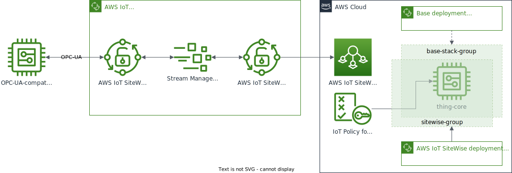

# AWS IoT Greengrass V2 AWS IoT SiteWise Deployment

This deployment, AWS IoT SiteWise Deployment, extends the capabilities of the [base](../base) accelerator stack by adding a new thing group, and Greengrass deployment for the existing Greengrass core. The functionality of the Greengrass deployment leverages several AWS-provided components with the ability to ingest data from an OPC UA endpoint using an AWS IoT SiteWise gateway component and stream the data to AWS IoT SiteWise.

This is deployed as a [nested stack](https://docs.aws.amazon.com/AWSCloudFormation/latest/UserGuide/using-cfn-nested-stacks.html) where the root stack is the base implementation accelerator. This stack creates the following resources:

- Thing group - A group specific to this accelerator, the existing thing is added and targeted for the new component
- IoT policy - An AWS IoT policy attached to the existing certificate extending the ability to publish batch property values to AWS IoT SiteWise
- Greengrass deployment - The Greengrass components targeted for the new Thing group.
- (Optional) AWS IoT SiteWise asset model and two sample assets that can work with the sample OPC UA server provided for local testing

Once this is fully deployed, the Greengrass core device will receive and deploy the required components immediately or when next started.

> **NOTE:** This accelerator is intended for educational use only and should not be used as the basis for production workloads without fully reviewing the component and its artifacts.

## AWS IoT SiteWise Deployment Use Case

This accelerator demonstrates the capability for ingesting data from an OPC UA endpoint such as in a factory, plant or other Operational Technology (OT) environment and streaming the data to [AWS IoT SiteWise](https://aws.amazon.com/iot-sitewise/).

In a practical setting, this appraoch can be used to collect and organise industrial data, by reading data directly from servers and historians over the OPC-UA protocol. Once ingested, data can be visualised and analysed to react to anomalies or identify differences across facilities.

For additional information on applicable use cases, and data ingestion and security patterns please explore the following workshops:

- [AWS IoT SiteWise Workshop](https://iot-sitewise.workshop.aws/en/introduction.html)
- [AWS IoT SiteWise Edge Workshop](https://iot-sitewise-edge.workshop.aws/)
- [IIoT Security Workshop](https://catalog.us-east-1.prod.workshops.aws/workshops/5b543f4c-1952-4bd9-96c8-b009c16da2bc/en-US)

## Design Pattern

The following architecture shows the deployment of this accelerator (aligned to the base implementation).



1. The CDK stack creates a new thing group (`sitewise-group`), adds the existing `thing-core`, and deploys the required components. The two thing group deployments are merged and sent to the Greengrass core.
1. The OPC UA collector component starts and ingests data from the configured OPC UA endpoint.
1. The data are sent to the AWS IoT SiteWise publisher component via the local stream manager.
1. The AWS IoT SiteWise publisher component publishes the data to AWS IoT SiteWise, via the newly created AWS IoT SiteWise gateway associated with the Greengrass deployment.

## Folder Structure

```text
aws_iot_sitewise
├── README.md             <--- this file
├── cdk                   <--- builds and deploys CloudFormation to cloud
│   ├── bin
│   ├── cdk.json
│   ├── components
│   ├── jest.config.js
│   ├── lib
│   ├── opcua-server.ts   <--- Sample OPC UA server provided for local testing
│   ├── package-lock.json
│   ├── package.json
│   ├── test
│   └── tsconfig.json
```

As a nested stack, this uses CDK to build and deploy the resources. As it uses CDK constructs from the `base` stack via relative paths, do not move this directory without first updating the paths in `lib/SiteWiseStack.ts` first.

If using Docker, continue to use the `base/docker` directory for starting and stopping the container.

## Deploying the Accelerator

> **NOTE:** All accelerators use the same structure and steps to deploy, even if the actual output of the steps differ slightly.

Use the steps from the _base implementation_ stack to deploy the base CDK stack. These are the general steps to follow for both local and AWS Cloud9.

This accelerator is designed to deploy as a combination of AWS CloudFormation stacks in the cloud and run AWS IoT Greengrass as a Docker container on your local system or through [AWS Cloud9](https://aws.amazon.com/cloud9/). This provides a consistent and quick approach to testing or investigating functionality without impacting or leaving behind unneeded artifacts locally, or in the cloud. To launch this accelerator as a Docker container, there are a few prerequisites and steps to complete. It is assumed you have basic experience with AWS IoT via the console and have familiarity with the command line interface (CLI).

### Prerequisites

The following is a list of prerequisites to deploy the accelerator:

1. The base implementation stack must be deployed. It is also recommended to configure and test the base implementation before deploying this stack.
1. The existing OPC UA endpoint details are available, such as the hostname address and port. A typical OPC UA endpoint may look like `opc.tcp://{OPC_UA_IP}:{OPC_UA_PORT}` or `opc.tcp://{OPC_UA_IP}:{OPC_UA_PORT}/discovery`.

> **NOTE:** If you do not have an existing OPC UA endpoint you can use the local OPC UA server based on [node-opcua](https://github.com/node-opcua/node-opcua) provided as part of this accelerator. Please refer to the separate section "Local OPC UA Server" below for additional information.

### Create and Launch the Accelerator Locally or using AWS Cloud 9

This approach uses your local system for installation and running the accelerator, but the same commands can be used if testing from AWS Cloud9 generally using the `default` value for `PROFILE_NAME`.

**Option A. If you <ins>already have an existing OPC UA endpoint</ins>:**

```bash
export OPC_UA_ENDPOINT=opc.tcp://YOUR_OPC_UA_ENDPOINT
cd aws-iot-greengrass-accelerators/v2/aws_iot_sitewise/cdk
npm install
npm run build
# replace PROFILE_NAME with your specific AWS CLI profile that has username and region defined.
# Also note that the base stack name must be provided.
cdk --profile PROFILE_NAME deploy \
   --context baseStack="gg-accel-base" \
   --parameters opcUaEndpoint="${OPC_UA_ENDPOINT}" \
   --parameters deploySampleAssetModel=false
```

**Option B. If you <ins>do not have an existing OPC UA endpoint</ins>:**

Once deployed, please refer to "Local OPC UA Server" below for additional information on how to use the local demo endpoint to test the accelerator.

```bash
cd aws-iot-greengrass-accelerators/v2/aws_iot_sitewise/cdk
npm install
npm run build
# replace PROFILE_NAME with your specific AWS CLI profile that has username and region defined.
# Also note that the base stack name must be provided.
cdk --profile PROFILE_NAME deploy \
   --context baseStack="gg-accel-base" \
   --parameters deploySampleAssetModel=true
```

The result of a successful deployment will look like this:

```bash
✅  gg-accel-sitewise

Stack ARN:
arn:aws:cloudformation:us-west-2:123456789012:stack/gg-accel-sitewise/82df9e50-fa21-11eb-ba37-02268e8a52f9
```

At this point the CloudFormation stack is deployed and if the Greengrass core is running, it will have received the new deployment.

### Local OPC UA Server

The accelerator comes with a simple local OPC UA server based on [node-opcua](https://github.com/node-opcua/node-opcua), which can be used when you do not have an existing OPC UA endpoint to connect to.

The demo endpoint works in conjunction with a stack deployment using the `deploySampleAssetModel=true` stack parameter, which provides the following:

1. A `SampleAssetModel` that defines an AWS IoT SiteWise asset model representing a simple fan with a fan speed attribute
2. Two AWS IoT SiteWise assets `East Wing Fan` and `West Wing Fan` based on `SampleAssetModel` and associated with `/AnyCompany/1/Generator/FanSpeed` and `/AnyCompany/2/Generator/FanSpeed` properties respectively

Once the above are deployed, you can start the sample server in a separate terminal session:

```bash
cd aws-iot-greengrass-accelerators/v2/aws_iot_sitewise/cdk
npm run opcua-server
```

The result of a successful server launch will look like this:

```
> sitewise-accelerator@0.1.0 opcua-server
> ts-node opcua-server.ts

  server PID          : ####
  server on port      : 26543
  endpointUrl         : opc.tcp://####:26543
  serverInfo          :
      applicationUri                  : urn:7fd1b0d464dfda71:NodeOPCUA-Server
      productUri                      : NodeOPCUA-Server
      applicationName                 : locale=en text=NodeOPCUA
      applicationType                 : 0
      gatewayServerUri                :
      discoveryProfileUri             :
      discoveryUrls                   :
  buildInfo           :
      productUri                      : NodeOPCUA-Server
      manufacturerName                : NodeOPCUA : MIT Licence ( see http://node-opcua.github.io/)
      productName                     : Sample NodeOPCUA Server for AWS IoT SiteWise
      softwareVersion                 : 2.91.0
      buildNumber                     : 0
      buildDate                       : Sat Feb 01 2020 00:00:00 GMT+0000 (Coordinated Universal Time)

  server now waiting for connections. CTRL+C to stop
```

When the accelerator connects to or disconnects from the server you will see console messages like:

```
Client connected with address =  ::ffff:172.18.0.2  port =  47092
...
Client disconnected with address =  ::ffff:172.18.0.2  port =  47092
```

You can use `CTRL+C` to stop the demo server.

Finally, you can verify that OPC UA data ingestion is working correctly by going to **AWS IoT SiteWise > Assets** in your AWS console, selecting one of the demo assets provided (e.g. `West Wing Fan`) and veryfying that the `FanSpeed` value gets updated by looking at the `Measurements` tab.

### Accelerator Cleanup

To stop and completely remove this accelerator, follow these steps:

1. From the command line where Greengrass is running (the `docker-compose` command was started), either locally on in Cloud 9, stop the Greengrass container byt entering CTRL+C and then:

   ```bash
   docker-compose down
   ```

1. With the container stopped, change to the component's CDK directory and issue the command to _destroy_ the CloudFormation stack:

   ```bash
   cd aws-iot-greengrass-accelerators/v2/aws_iot_sitewise/cdk
   # For Cloud9
   cdk destroy --context baseStack="gg-accel-base"
   # For locally running (replace PROFILE_NAME with one used to create stack)
   # Change baseStack if the parent stacks' default name was not used
   cdk destroy --profile PROFILE_NAME --context baseStack="gg-accel-base"
   ```

   > **NOTE:** This will only destroy the `aws_iot_sitewise` component resources and not the base stack. Also, since the components have already been deployed to the Greengrass core, they will continue to run unless are locally deleted via the `greengrass-cli`, or the Greengrass configuration is reset.

   At this point, all `aws_iot_sitewise` resources have been deleted.

1. Review any CloudWatch Logs log groups and delete these if needed.

All traces of the component including the thing group and additional AWS IoT Core policy permissions have been removed from the Greengrass core implementation.

### Frequently Asked Questions

#### Should I use this code for my production workloads?

In its current form, no. This component is not suitable for production workloads and intended to demonstrate the capabilities of AWS IoT Greengrass for data ingestion using OPC UA. To be production-ready the accelerator would require support for additional configuration options such as authentication mechanisms to cater for different OPC UA endpoint configurations.