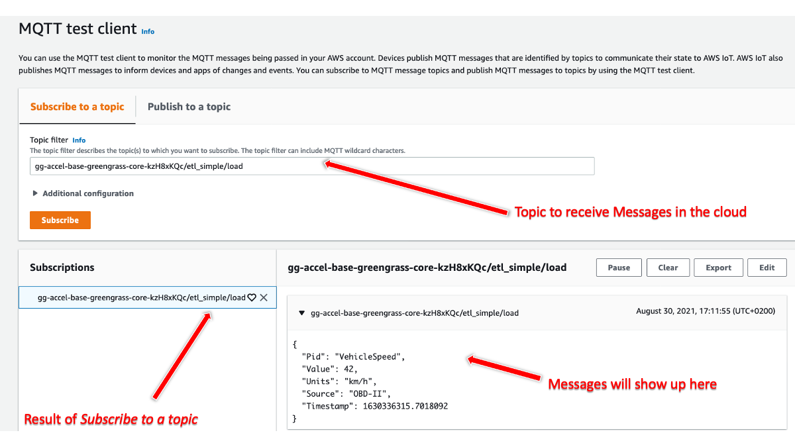

# AWS IoT Greengrass V2 Extract, Transform, and Load Simplified Deployment

The AWS IoT Greengrass accelerators (accelerators) demonstrate common design patterns or use cases for both AWS IoT Greengrass Version 1 (V1) and also AWS IoT Greengrass Version 2 (V2).

This deployment, Extract, Transform, and Load Simplified (ETL Simple), extends the capabilities of the [base](../base) accelerator stack for AWS IoT Greengrass V2 by adding a new thing group, three AWS IoT Greengrass components, and AWS IoT Greengrass deployment for the existing AWS IoT Greengrass core.

The three components are called `ggAccel.etl_simple.extract` (Extract Component), `ggAccel.etl_simple.transform` (Transform Component), and `ggAccel.etl_simple.load` (Load Component). The Extract component reads example OBD II messages from the file `events1.txt` and publishes them to a local topic. The Transform component reads from that topic, transforms the message into human-readable JSON messages and publishes them locally using [Interprocess Communication](https://docs.aws.amazon.com/greengrass/v2/developerguide/interprocess-communication.html). The Load Process reads from that topic and publishes every twentieth message to AWS IoT Core.

This is deployed as a [nested stack](https://docs.aws.amazon.com/AWSCloudFormation/latest/UserGuide/using-cfn-nested-stacks.html) where the root stack is the base implementation accelerator. This stack creates the following resources:

- Thing group - A group specific to this accelerator, the existing thing is added and targeted for the new component
- IoT policy - An AWS IoT policy attached to the existing certificate extending the ability to publish and subscribe on the topics used by the component
- Three AWS IoT Greengrass component - The application logic (recipe and artifacts) for each component deployable to AWS IoT Greengrass cores. Part of the AWS IoT Greengrass deployment.
- AWS IoT Greengrass deployment - The AWS IoT Greengrass components targeted for the new Thing group.

Once this is fully deployed, the AWS IoT Greengrass core device will receive and deploy the components immediately or when next started.

> **NOTE:** This accelerator is intended for educational use only and should not be used as the basis for production workloads without fully reviewing the component and it's artifacts.

# Extract, Transform, and Load Use Case

Imagine we want to collect from a vehicle multiple times per-second, transform and compute into a friendly formation, and when connected, send the messages in the cloud. As the vehicle travels into areas without Internet coverage, we want to ensure the local data collection continues and messages are ultimately stored in the cloud once coverage is restored.

In this simplified example, the `events1.txt` file contains the messages and acts, together with the Extract Component, as OBD-II data source. The content of every messages is transformed from the 8-bye OBD-II values (example: 1562433539.743263 7E8 0341055600000000)into a readable JSON formatted message.

Finally, individual records are sent to AWS IoT Core via MQTT.

# Design Pattern

The following architecture shows the deployment of this accelerator (aligned to the base implementation).


1. The CDK stack creates a new thing group (`etl-simple-group`), adds the existing `thing-core`, and creates a deployment containing the `ggAccel.etl.extract`, `ggAccel.etl.transform` and `ggAccel.etl.load` components. The two thing group deployments are merged and sent to the AWS IoT Greengrass core. Then the components start.
1. The Extract component reads the data from the file `events1.txt` publishes the data to the topic `core-name/etl_simple/extract`.
1. The Transform components subscribes to the topic `core-name/etl_simple/extract` and transforms each arriving message from 8-bye OBD-II values into JSON formatted messages. Those then are published to the local topic `core-name/etl_simple/transform.
1. The Load process subsribes to the topic `core-name/etl_simple/transform `and publishes every twentieth message to the topic `core-name/etl_simple/load` over MQTT in AWS IoT Core.

# Folder Structure

```text
etl_simple
├── README.md             <--- this file
├── cdk                   <--- builds and deploys CloudFormation to cloud
│   ├── bin
│   ├── cdk.json
│   ├── components
│   ├── jest.config.js
│   ├── lib
│   ├── package-lock.json
│   ├── package.json
│   ├── test
│   └── tsconfig.json
```

The CDK is used here to build and deploy resources for a nested stack. As it uses CDK constructs from the `base` stack via relative paths, do not move this directory without first updating the paths in `lib/EtlSimpleStack.ts`.

If using Docker, continue to use the `base/docker` directory for starting and stopping the container.

# Deploying the Accelerator

> **NOTE:** All accelerators use the same structure and steps to deploy, even if the actual output of the steps differ slightly.

Use the steps from the _base implementation_ stack to deploy the CDK stack. These are the general steps to follow for both local and AWS Cloud9.

This accelerator is designed to deploy as a combination of AWS CloudFormation stacks in the cloud. You can run AWS IoT Greengrass as a Docker container on your local system or through [AWS Cloud9](https://aws.amazon.com/cloud9/). This provides a consistent and quick approach to testing or investigating functionality. To launch this accelerator as a Docker container, there are a few prerequisites and steps to complete.

It is assumed you have basic experience with AWS IoT via the console and have familiarity with the AWS command line interface (AWS CLI).

## Prerequisites

The following is a list of prerequisites to deploy the accelerator:

1. The base implementation stack must be deployed. It is also recommended to configure and test the base implementation before deploying this stack.

## Create and Launch the Accelerator

This approach uses your local system for installation and running the accelerator, but the same commands can be used if testing from AWS Cloud9.

1. Change into the `v2/etl_simple/cdk/` directory for the accelerator, then build and deploy the CloudFormation stack:

   > **NOTE:** The first time `cdk deploy` is run, it will take longer as there are Docker images required to build some of the resources. You will see Docker-related messages in your terminal session. Subsequent runs will only take a few additional seconds.

   ```bash
   cd aws-iot-greengrass-accelerators/v2/etl_simple/cdk
   npm install
   npm run build
   # replace PROFILE_NAME with your specific AWS CLI profile that has username and region defined.
   # Also note that the base stack name must be provided.
   cdk --profile PROFILE_NAME deploy --context baseStack="gg-accel-base"
   ```

   The result of a successful deployment will look similar to this:

   ```bash
   ✅  gg-accel-etl-simple

   Outputs:
   gg-accel-etl-simple.CloudPublishTopic = gg-accel-base-greengrass-core-kzH8xKQc/etl_simple/load
   Stack ARN:
   arn:aws:cloudformation:us-west-2:123456789012:stack/gg-accel-etl-simple/870a6f50-09a3-11ec-a262-0ad1fb9d7ee6
   ```

At this point the CloudFormation stack is deployed and if the AWS IoT Greengrass core is running, it will have received the new deployment. Copy the _CloudPublishTopic_ topic for use when processing the MQTT messages in the Cloud.

## Investigating the Accelerator

Once deployed, you can use either Test client from the AWS IoT Core console or via an MQTT client where you can publish and subscribe to topics. The examples below use the Test client.

Create a _subscription_ to the `core-name/etl_simple/load` topic from the previous section. This subscription will allow you to receive the _transformed message_ from the locally running processes.



## Accelerator Cleanup

To stop and completely remove this accelerator, follow these steps:

1. From the command line where AWS IoT Greengrass is running (the `docker-compose` command was started), either locally or in Cloud 9, stop the AWS IoT Greengrass container byt entering CTRL+C and then:

   ```bash
   docker-compose down
   ```

1. With the container stopped, change to the component's CDK directory and issue the command to _destroy_ the CloudFormation stack:

   ```bash
   cd aws-iot-greengrass-accelerators/v2/etl_simple/cdk
   # For Cloud9
   cdk destroy --context baseStack="gg-accel-base"
   # For locally running (replace PROFILE_NAME with one used to create stack)
   # Change baseStack if the parent stacks' default name was not used
   cdk destroy --profile PROFILE_NAME --context baseStack="gg-accel-base"
   ```

   > **NOTE:** This will only destroy the `etl_simple` component resources and not the base stack. Also, since the component has already been deployed to the AWS IoT Greengrass core, it will continue to run unless it is locally delete via the `greengrass-cli`, or the AWS IoT Greengrass configuration is reset.

   At this point, all `etl_simple` resources have been deleted.

1. Review any CloudWatch Logs log groups and delete these if needed.

All traces of the component including the thing group and additional AWS IoT Core policy permissions have been removed from the AWS IoT Greengrass core implementation.

## Frequently Asked Questions

### Should I use this code for my production workloads?

In its current form, no. These components are not suitable for production workloads and intended to demonstrate the capabilities of an extract-transform-load process in a simple manner.

## Implementation Notes

The ETL Simple components are Python based scripts that uses the IPC mechanism of the Nucleus to subscribe and publish to set topics locally and in AWS IoT Core. They are long running process that will process each individual message separately.
