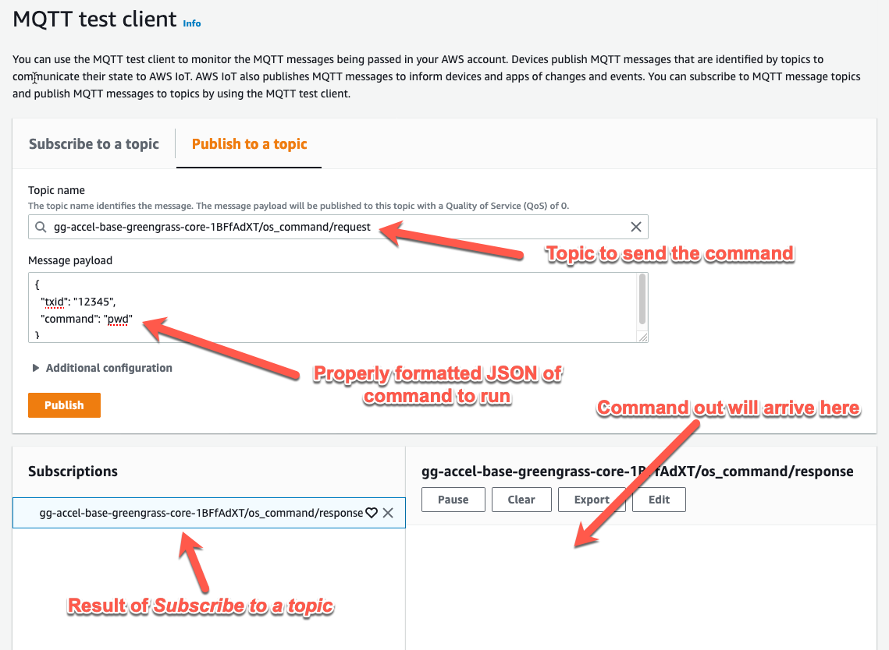

# AWS IoT Greengrass V2 Operating System Command Component

This component, Operating System Command (OS Command), extends the capabilities of the [base](../base) accelerator stack by adding a new thing group, Greengrass component, and Greengrass deployment for the existing Greengrass core. The functionality of the `ggAccel.os_command` component provides the ability to publish an operating system command via an MQTT message to a topic on AWS IoT Core, have it execute on the Greengrass core device, and return the commands output to a different MQTT topic. By publishing the command on topic and subscribing to the response on another topic, you can remotely issue commands and receive results via the cloud.

This is deployed as a [nested stack](https://docs.aws.amazon.com/AWSCloudFormation/latest/UserGuide/using-cfn-nested-stacks.html) where the root stack is the base implementation accelerator. This stack creates the following resources:

- Thing group - A group specific to this accelerator, the existing thing is added and targeted for the new component
- IoT policy - An AWS IoT policy attached to the existing certificate extending the ability to publish and subscribe on the topics used by the component
- Greengrass component - The application logic (recipe and artifacts) deployable to Greengrass cores. Part of the Greengrass deployment.
- Greengrass deployment - The Greengrass component targeted for the new Thing group.

Once this is fully deployed, the Greengrass core device will receive and deploy the component immediately or when next started.


> **NOTE:** This accelerator is intended for educational use only and should not be used as the basis for production workloads without fully reviewing the component and it's artifacts.

# OS Command Use Case

This accelerator demonstrates the capability for a local Python application to receive commands from the Cloud, run them locally, and then publish back the results to another topic in the Cloud. It demonstrates Cloud command and control capability to a remote device, the ability for a local application to interact with IPC topics, execute commands locally, and response to successful or unsuccessful commands.

In practical operation, it can be used to query the status of host operating system, download and upgrade software, or any other activities normally performed from the host operating systems command line interface (CLI). It can also be used as an example for performing command and control operations originating from the cloud and taking local action.

# Design Pattern

The following architecture shows the deployment of this accelerator (aligned to the base implementation).


1. The CDK stack creates a new thing group (`os-cmd-group`), adds the existing `thing-core`, and deploys the `os_cmd` component. The two thing group deployments are merged and sent to the Greengrass core.
1. The component starts and subscribes to a topic for incoming commands.
1. When a command `uptime` is issued by a person or application it is sent to the component and run as a terminal command.
1. When the command has completed the component publishes the result, `15:00 up 13 days...` back to the AWS Cloud for the person or application to use.

# Folder Structure

```text
os_cmd
├── README.md             <--- this file
├── cdk                   <--- builds and deploys CloudFormation to cloud
│   ├── bin
│   ├── cdk.json
│   ├── components
│   ├── jest.config.js
│   ├── lib
│   ├── package-lock.json
│   ├── package.json
│   ├── test
│   └── tsconfig.json
```

As a nested stack, this uses CDK to build and deploy the resources. As it uses CDK constructs from the `base` stack via relative paths, do not move this directory without first updating the paths in `lib/OsCommandStack.ts` first.

If using Docker, continue to use the `base/docker` directory for starting and stopping the container.

# Deploying the Accelerator

> **NOTE:** All accelerators use the same structure and steps to deploy, even if the actual output of the steps differ slightly.

Use the steps from the _base implementation_ stack to deploy the CDK stack. These are the general steps to follow for both local and AWS Cloud9.

This accelerator is designed to deploy as a combination of AWS CloudFormation stacks in the cloud and run AWS IoT Greengrass as a Docker container on your local system or through [AWS Cloud9](https://aws.amazon.com/cloud9/). This provides a consistent and quick approach to testing or investigating functionality without impacting or leaving behind unneeded artifacts locally, or in the cloud. To launch this accelerator as a Docker container, there are a few prerequisites and steps to complete. It is assumed you have basic experience with AWS IoT via the console and have familiarity with the command line interface (CLI).

## Prerequisites

The following is a list of prerequisites to deploy the accelerator:

1. The base implementation stack must be deployed. It is also recommended to configure and test the base implementation before deploying this stack.

## Create and Launch the Accelerator Locally

This approach uses your local system for installation and running the accelerator, but the same commands can be used if testing from AWS Cloud9.

1. Change into the `v2/os_cmd/cdk/` directory for the accelerator, then build and deploy the CloudFormation stack:

   > **NOTE:** The first time `cdk deploy` is run, it will take longer as there are Docker images required to build some of the resources. You will see Docker-related messages in your terminal session. Subsequent runs will only take a few additional seconds.

   ```bash
   cd aws-iot-greengrass-accelerators/v2/os_cmd/cdk
   npm install
   npm run build
   # replace PROFILE_NAME with your specific AWS CLI profile that has username and region defined.
   # Also note that the base stack name must be provided.
   cdk --profile PROFILE_NAME deploy --context baseStack="gg-accel-base"
   ```

   The result of a successful deployment will look like this:

   ```bash
   ✅  gg-accel-os-command
   
   Outputs:
   gg-accel-os-command.RequestTopic = gg-accel-base-greengrass-core-1BFfAdXT/os_command/request
   gg-accel-os-command.ResponseTopic = gg-accel-base-greengrass-core-1BFfAdXT/os_command/response
   Stack ARN:
   arn:aws:cloudformation:us-west-2:123456789012:stack/gg-accel-os-command/82df9e50-fa21-11eb-ba37-02268e8a52f9
   ```

At this point the CloudFormation stack is deployed and if the Greengrass core is running, it will have received the new deployment. Copy the _Request_ and _Response_ topics for use when sending and receiving MQTT messages.

## Investigating the Accelerator

Once deployed, you can use either Test client from the AWS IoT Core console or via an MQTT client where you can publish and subscribe to topics. The examples below use the Test client.

First, create a *subscription* to the `core-name/os_command/response` topic from the previous section. This subscription will allow us to receive the *response* from an issues command. Next, select the publish tab and paste in`.../os_command/request. Finally, enter a command and select Publish.




With all of this setup, you can send commands to the component and receive the response. Here are a couple commands (message payloads) to monitor how the component deals with different attributes and format such as invalid JSON.

### General command

This command will return the current working directory of the component.

**Message payload**

```json
{
  "txid": "12345",
  "command": "pwd"
}
```

**Command response**

```json
{
  "response": "/greengrass/v2/work/ggAccel.os_command\n",
  "txid": "12345",
  "return_code": 0
}
```


### Long response command (JSON)

This command will return the contents of a directory listing in `/etc` as a serialized JSON string.

**Message payload**

```json
{
  "txid": "12345",
  "command": "ls -ltr /etc"
}
```

**Command response**

```json
{
  "response": "total 1128\n-rw-r--r-- 1 root root 670293 Jun  7  2013 services\n-rw-r--r-- 1 root root    233 Jun  7  2013 printcap\n...CONTENT_SHORTENED---------- 1 root root    314 Aug 16 19:49 gshadow\n",
  "txid": "12345",
  "return_code": 0
}
```


### Long response command (TEXT)

This command will return the contents of a directory listing in `/etc` in human readable output.

**Message payload**

```json
{
  "txid": "12345",
  "command": "ls -ltr /etc",
  "format": "text"
}
```

**Command response**

```text
TX_ID: 12345
RETURN_CODE: 0
RESPONSE:
total 1128
-rw-r--r-- 1 root root 670293 Jun  7  2013 services
-rw-r--r-- 1 root root    233 Jun  7  2013 printcap
-rw-r--r-- 1 root root      0 Jun  7  2013 motd
...CONTENT_SHORTENED
---------- 1 root root    314 Aug 16 19:49 gshadow
```

### Invalid command

This command will return an error for missing attributes.

**Message payload**

```json
{
  "message": "Hello from AWS IoT Core"
}
```

**Command response**

```json
{
  "response": "The attributes 'txid' and 'command' missing from request",
  "return_code": 255
}
```


As you run there and other commands, review the log file output. Also, the main Python code located here:

````
aws-iot-greengrass-accelerators/v2/base/cdk/components/ggAccel.example.HelloWorld/artifacts/ggAccel.example.HelloWorld/1.0.0/hello_world.py
````

Has additional details on the `format` and `timeout` attributes.

By investigating the component's recipe file, artifacts, and and the commands that create and publish the component via the CDK, you should now have a better understanding of:

- Command and control from AWS IoT Core to a running component on Greengrass
- How the component can interact with local system resources
- Using language dependencies either at the operation system level or within the artifact folder to develop feature rich components

## Accelerator Cleanup

To stop and completely remove this accelerator, follow these steps:

1. From the command line where Greengrass is running (the `docker-compose` command was started), either locally on in Cloud 9, stop the Greengrass container byt entering CTRL+C and then:

   ```bash
   docker-compose down
   ```

1. With the container stopped, change to the component's CDK directory and issue the command to _destroy_ the CloudFormation stack:

   ```bash
   cd aws-iot-greengrass-accelerators/v2/os_cmd/cdk
   # For Cloud9
   cdk destroy --context baseStack="gg-accel-base"
   # For locally running (replace PROFILE_NAME with one used to create stack)
   # Change baseStack if the parent stacks' default name was not used
   cdk destroy --profile PROFILE_NAME --context baseStack="gg-accel-base"
   ```

   > **NOTE:** This will only destroy the `os_cmd` component resources and not the base stack. Also, since the component has already been deployed to the Greengrass core, it will continue to run unless it is locally delete via the `greengrass-cli`, or the Greengrass configuration is reset.

   At this point, all `os_cmd` resources have been deleted.

1. Review any CloudWatch Logs log groups and delete these if needed.


All traces of the component including the thing group and additional AWS IoT Core policy permissions have been removed from the Greengrass core implementation.

## Frequently Asked Questions

### Should I use this code for my production workloads?

In its current form, no. This component is not suitable for production workloads and intended to demonstrate the capabilities of command and control and system interaction in a simple manner. To be production-ready would require additional validation of commands from the cloud and though the subprocess communication.

## Implementation Notes

The OS Command component is a Python based script that uses the IPC mechanism of the Nucleus to subscribe and publish to set topics in AWS IoT Core. It is a long running process that will process each individual message separately.
